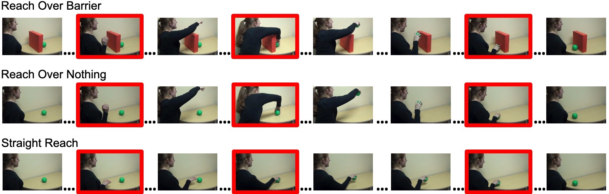

```{r setup, warning = FALSE}
library("papaja")
library(tidyverse)
library(lme4)
library(lmerTest)
library(here)
library(kableExtra)
library(knitr)
library(ggthemes)
library(dplyr)
library(viridis)

```

```{r analysis-preferences}
# Seed for random number generation
set.seed(42)
knitr::opts_chunk$set(cache.extra = knitr::rand_seed, echo = FALSE, warning = FALSE, message = FALSE, cache = FALSE)

# make sure summary() uses Type III sums of squares
afex::set_sum_contrasts()

# turn off scientific notation
options(scipen = 999)

# set plot theme
theme_set(theme_bw() + 
            theme(strip.background = element_blank(), 
                  panel.grid = element_blank())) # nice theme with limited extras
```

```{r load data}
participants <- read_csv(here("data/participant_data.csv"))
kg_data <- read_csv(here("data/cleaned_dt_data.csv"))
seg_judgments <- read_csv(here("data/seg_judgment_data.csv"))

#change slide 2 to be a within
kg_data <- kg_data %>% 
  mutate(slide_type = case_when(slide_num_adj == 2 ~ "within",
                                TRUE ~ slide_type))

```
Our everyday experience of the world centers on a sense of discrete events that occur across time. For example, we might experience a simple trip to the grocery store as a series of events that include parking the car, entering the store, putting groceries into a cart, paying the cashier, navigating a crowded parking lot, and loading up the trunk. Interestingly, the activity actually underlying this experience of events tends to be complex, dynamic, and evanescent. How do we transform the continuous, multi-modal stream that actually occurs into the experience of an event sequence? Answering this question has proven to be surprisingly challenging [@baldwin_baird_1999; @baldwin_baird_2001; @kurby_zacks_2008; @newtson_1977; @zacks_2007; @zacks_tversky_2001]. Even more challenging is to answer how infants and young children come to acquire adult-like skill at rendering continuously flowing experience in terms of event sequences. One challenge that has slowed progress on these issues is methodological: a dearth of available techniques for examining children's processing as information unfolds across time. In this paper, we showcase a valuable new method for this purpose, and report novel information about the nature of event-processing skill in preschool-aged children. 

A recent surge of research on adults' event processing offers starting information about the perceptual and cognitive skills at play in this mental rendering process. For one, adult observers display high levels of agreement when asked to consciously report on the location of event boundaries in continuously streaming activity sequences [@newtson_1973]; as well, implicit indicators of processing, like fMRI and self-paced slideshow viewing [@baldassano_2017; @hard_2011; @kosie_baldwin_2019a; @kosie_baldwin_2019b], reveal consistent patterns of event segmentation. Event boundary judgments tend to reflect adults' analysis of the goal structure inherent in activity streams, although motion properties also influence such judgments [e.g., @newtson_1977; @zacks_2004; @zacks_2006b]. Further, adults' success at achieving a segmental analysis of streaming activity carries functional significance; that is, accurately identifying event boundaries predicts both memory for event content [@sargent_2013], and the ability to perform everyday sequences of action [@bailey_2013]. 

Recent research also reveals information about how event-segmentation skills begin to emerge in children's development, although many questions are yet unanswered. Even infants as young as six months appear to be sensitive to the segmental structure of at least some kinds of activity streams [@hespos_2009; @hespos_2010; @saylor_2007; @baldwin_2001; @pace_2020; @baldwin_2012; @stahl_2014]. Like adults, infants' sensitivity to event units within continously flowing activity predicts their event memory [@sonne_2016; @sonne_2017]. 

Among the unanswered questions, however, is the degree to which early event segmentation rides on knowledge of goal structure. On the one hand, a large literature provides extensive evidence that children, like adults, are sensitive to goal structure and often prioritize it in their processing of unfolding activity [e.g., @buresh_woodward_2007; @falckytter_2006; @gergely_csibra_2003; @gergely_1995; @gredeback_melinder_2010; @meltzoff_1995; @olofson_baldwin_2011; @phillips_2002; @woodward_1998; @woodward_2009]. However, this body of research doesn't provide insight into the extent to which children's goal-related knowledge influences their segmental analysis of continuously unfolding events. In fact, traditional methods used in the bulk of research on children's knowledge of goal structure (e.g., habituation-dishabituation paradigms) do not lend themselves well to answering questions about event segmentation. To do so requires a method that indexes children's processing of continuously streaming activity as it unfolds.

Hard, Recchia, and Tversky's [-@hard_2011] dwell-time paradigm is just such a technique, and it has previously been successfully employed with preschool-aged children [e.g., @meyer_2011]. A primary goal of the present research was to harness the dwell-time paradigm to probe the extent to which children's analysis of goal structure influences their event segmentation. In the dwell-time task, slideshows are constructed by extracting still frames at regular intervals (e.g., one frame per second) from videos of unfolding activity. Observers click a computer mouse to advance at their own pace through slideshows. Latency between mouse clicks (i.e., “dwell times”) indexes moment-to-moment changes in attention as activity unfolds. Attentional profiles as revealed by dwell times reflect adults' segmental analysis of unfolding activity, including: (a) surges in attention at event boundaries ("boundary advantage"); and (b) especially pronounced surges to boundaries that are at higher levels within a goal hierarchy ("hierarchical advantage") [@hard_2011; @kosie_baldwin_2019a; @kosie_baldwin_2019b]. These findings reveal that, as sensory information unfolds across time, adults as well as children modulate attention in a manner that reflects their segmental analysis of the dynamic activity stream.

Recent research begins to clarify mechanisms underlying the tendency to selectively focus attention on segment boundaries within dynamic activity. Segment boundaries represent information-rich regions for sampling event content: as one event unit ends, what will happen next is suddenly uncertain. Selectively attending to these regionss thus enhances detection of informative content and facilitates event comprehension [@baldwin_kosie_inPress; @shin_dubrow_inPress; @zacks_2011]

Some initial evidence indicates that children, like adults, display a boundary advantage in dwell-time patterns measured for relatively familiar activity sequences [@meyer_2011; @ross_baldwin_2015]. However, another study failed to find these key patterns in preschoolers' dwell times [@sage_baldwin_2015], engendering some uncertainty about the usefulness of the dwell-time paradigm for investigating children's event segmentation. The present research was thus also designed to provide additional information about the value of the dwell-time paradigm for this purpose. 

In the present research we specifically employed the dwell-time paradigm to examine the extent to which children's knowledge of goal structure influences their segmental analysis of an unfolding activity stream, relative to the influence of differential motion patterns. We selected a type of event that even very young children are believed to understand with respect to goal structure; namely, the activity of reaching for, grasping, and retrieving a ball. In previous research, Phillips and Wellman [-@phillips_wellman_2005] employed this very event to examine 12-month-old infants' ability to recognize the overarching goal of object retrieval independent of the specific motion pattern used to effect that goal. In this study, infants were habituated to an event in which an actor reached over a barrier to grasp and retrieve a ball. During subsequent test, infants displayed recovered interest when the actor displayed the identical motion pattern in a new context that appeared to violate canonical goal-oriented action (reaching over a non-existent barrier to grasp and retrieve the ball). In contrast, infants displayed continued habituation when the actor exhibited a novel motion pattern (reaching straight toward the ball) that preserved the canonical action properties with the same goal structure. These findings have been interpreted as confirming infants’ sensitivity to an actor’s goal independent of the specific motions (e.g., arcing versus straight reach) produced to satisfy the goal.

We employed Phillips and Wellman's methodological design to investigate the relative degree to which goal structure, surface motion properties, and goal-structure violations influence how preschoolers deploy their attention as activity unfolds across time. We wondered what patterns would emerge in children's dwell times as they advanced at their own pace through each of the Phillips and Wellman events. In one sense, segmental structure was the same across the three events: an actor reached for, grasped, and retrieved a ball. If goal-related segmental analysis is the primary determinant of children's attentional deployment during processing, dwell times should exhibit surges at each of these event boundaries, but shouldn't differ across the three events, despite differences in motion patterns. Alternatively, however, dwell-time patterns might differ across events, for two possible reasons. One possibility is that children's dwell times would primarily pattern according to motion characteristics, in which case dwell times would be similar for events exhibiting the same motion characteristics (arcing reach over a barrier and arcing reach over no barrier) but different for events differing in motion characteristics (straight reach). Yet another possibility: given that canonical properties of goal-oriented actions were violated for one of the three events (an arcing reach with no visible barrier), dwell-time patterns might differ for this event relative to the other two events. In particular, the violation of expected motion characteristics might elicit enhanced dwelling in the relevant portion of the violating event stream (when the arc over the non-existent barrier actually occurred) relative to the comparable region in other events (the arcing motion over the barrier and the linearly progressing straight reach).

# Methods

```{r participant gender}
#number of participants of each gender
gender_ns <- participants %>% 
  count(gender) 

```
## Participants

Eighty-eight preschool-aged children (_M_ = `r round(mean(participants$age_months, na.rm = TRUE), 2)` months; range = 2.5 to 4.5 years; `r gender_ns$n[1]` female) were recruited to participate from a database of community members with children. Demographics reflected those of the surronding community; particpants were from primarily white and middle-class families. 

## Stimuli

Stimuli consisted of slideshows depicting an actor reaching for, and retrieving, a ball in three different ways [adapted from @phillips_wellman_2005]. In the _barrier_ slideshow, the actor reached over a barrier, grasped the ball, lifted it back over the barrier, and set it on the table in front of her. The _nothing_ slideshow depicted the actor using the same action pattern displayed in the barrier slideshow, but in the absence of a barrier. In the _straight_ slideshow, there was again no barrier present. However, this time the actor reached straight for the ball, grasped it, and pulled it straight back before setting it down on the table in front of her. During filming, the actor used a metronome to ensure that reaches unfolded at the same rate across the three slideshows. Slideshows were created by extracting still frames, at a rate of one frame per second, from these videos. Each slideshow contained 20 total slides, and participants viewed only one of the three slideshows (i.e., slideshow varied between subjects). As is standard practice across dwell-time studies [e.g., @kosie_baldwin_2019a; @kosie_baldwin_2019b; @hard_2011], data from the first and last slides were removed prior to analyses.

```{r pb correlation, include = FALSE}
# calculate point biserial correlation

cor <- cor.test(seg_judgments$total, seg_judgments$st_numeric)

```
## Boundary Judgments
We classified each slide as a boundary or non-boundary. Three total boundary slides were identified per slideshow, corresponding to slides depicting initiation of the reaching action, grasping the ball, and setting the ball on the table. Because care was taken to temporally align the three reaching actions during filming (i.e., using the metronome), these boundaries occurred at the same slide number across the three slideshows. Boundary judgments were verified by a group of 37 na&iuml;ve raters. A point-biserial correlation indexing agreement [following Zacks and colleagues' technique, e.g. @zacks_2006a; @kurby_zacks_2011] was high (_r~pb~_(`r cor$parameter`) = `r cor$estimate`, $p `r papaja::printp(cor$p.value)`$, 95% CI[`r cor$conf.int[[1]]`, `r cor$conf.int[[2]]`]). Example slides are depicted in Figure 1. The three slideshows and additional details about validation of boundary judgments are available on the Open Science Framework (OSF) [Link: [osf.io/m6q7r](https://osf.io/m6q7r); @kosie_baldwin_OSF].

```{r fig1, fig.cap="Examples of boundary and non-boundary slides from the _barrier_, _nothing_, and _straight_ slideshows. Boundary slides are outlined in red.", fig.align = "center"}


```

```{r pix change, include = FALSE}
# pixel change summary

# get only convolution-filtered pixel data from kg_data file  
pix <- kg_data %>% 
  filter(run == "first") %>% 
  dplyr::select(condition, slide_num_adj, slide_type, pix_adj) %>% 
  distinct()

# does pixel change differ across slide type and condition?
pix_aov <- summary(aov(pix_adj ~ slide_type * condition, data = pix))
pix_mod <- unlist(pix_aov)

# get means and sds for summary
pix_summary <- pix %>% 
  group_by(condition) %>% 
  summarise(mean = mean(pix_adj, na.rm = TRUE), 
            sd = sd(pix_adj, na.rm = TRUE))

b_v_s <- t.test(pix_adj ~ condition, data = filter(pix, condition != "nothing"))
n_v_s <- t.test(pix_adj ~ condition, data = filter(pix, condition != "barrier"))
b_v_n <- t.test(pix_adj ~ condition, data = filter(pix, condition != "straight"))

p.values <- c(b_v_s$p.value, n_v_s$p.value, b_v_n$p.value)
p.val.adj <- p.adjust(p.values, method = "bonferroni", n = length(p.values))

```
## Motion Change
To gain an objective measure of motion-pattern differences across slideshows, we calculated pixel change as an index of slide-to-slide motion change in each of the three slideshows [following @hard_2011]. A Canny Edge Detector convolution filter [@canny_1986] identified and highlighted high contrast areas of each slide image, corresponding to the edges of people and objects (see Figure 2). We then calcualted the degree of pixel change between adjacent convolution-filtered frames (@loucks_baldwin_2009; see OSF for further details). The resulting values indicated the average amount of pixel change between a given slide and the slide immediately preceding it. 

```{r fig2, fig.cap="Example slides from the _barrier_ (top), _nothing_ (middle), and _straight_ (bottom) slideshows before (left) and after (right) being passed through a convolution filter.", fig.align = "center", out.width = "4in"}


```

A one-way analysis of variance revealed that overall average pixel change values differed across the _barrier_ (_M_ =`r pix_summary$mean[1]`, _SD_ = `r pix_summary$sd[1]`), _nothing_ (_M_ =  `r pix_summary$mean[2]`, _SD_ = `r pix_summary$sd[2]`), and _straight_ slideshows (_M_ =  `r pix_summary$mean[3]`, _SD_ = `r pix_summary$sd[3]`), $F(`r pix_mod[["Df2"]]`, `r pix_mod[["Df4"]]`) = `r pix_mod[["F value2"]]`$, $p`r papaja::printp(pix_mod["Pr(>F)2"])`$. A set of Bonferroni-corrected pairwise comparisons confirmed the prediction that this difference was primarily driven by reduced pixel change for the _straight_ slideshow relative to both the _barrier_ or _nothing_ slideshows ($ps `r papaja::printp(p.val.adj[2])`$). Average pixel change did not differ between the _barrier_ and _nothing_ slideshows ($p `r papaja::printp(p.val.adj[3])`$). The difference in pixel change for boundary versus non-boundary slides did not reach statistical significance, $F(`r pix_mod[["Df1"]]`, `r pix_mod[["Df4"]]`) = `r pix_mod[["F value1"]]`$, $p = `r papaja::printp(pix_mod[["Pr(>F)3"]])`$. Thus, if a boundary advantage in dwell times turned out to be observed in subsequent analyses, it would be unlikely that this effect could be solely explained by differences in motion change between boundary and non-boundary slides. 

While there were overall differences in the magnitude of absolute pixel change between slideshows, the general patterns of pixel change were similar for the _barrier_ and _nothing_ slideshows, but differed between each of these slideshows relative to the the _straight_ reach slideshow. Because the _barrier_ and _nothing_ reaches unfolded in the same manner (arcing up and over) while the _straight_ reach did not, these patterns (depicted in Figure 3) were precisely what would be expected.

```{r fig3, fig.cap="Degree of absolute pixel change across the _barrier_, _nothing_, and _straight_ reach slideshows. Dashed lines indicate slides corresponding to event boundaries.", fig.align = "center", fig.width = 7}

# figure with different lines for the three conditions and a vertical line at boundaries
pix %>% 
  mutate(condition = recode(condition, barrier = "Reach Over Barrier",
                            nothing = "Reach Over Nothing", 
                            straight = "Straight Reach")) %>% 
ggplot(., aes(x = slide_num_adj, y = pix_adj, color = condition)) +
  geom_line(size = 1) +
  labs(x = "Slide Number", y = "Pixel Change", color = "Slideshow") + 
  scale_color_viridis(discrete = TRUE, option = "D") +
  geom_vline(xintercept = c(2, 9, 17), size = .75, color = "black", linetype = "dashed")

```

## Procedure
After consenting, children were invited to take a seat at the computer equipped with a wired mouse; a prominent sticker on the mouse indicated where to click. The experiment consisted of a training task and then the main dwell-time task (see OSF for additional details). The goal of the training task (a slideshow depicting a train moving from right to left across the screen) was simply to acquaint children with the experience of clicking the mouse to advance slides in order to see an event unfold. After completing the training task, children clicked through one of the three slideshows. After viewing the slideshow once, an image of a field and clouds was presented, and children then immediately clicked through the same slideshow a second time.

# Results
```{r participant summary, include = FALSE}
condition_ns <- kg_data %>% 
  distinct(subid, .keep_all = TRUE) %>% 
  count(condition) 

```
## Preparing Dwell Time Data
As described previously, dwell times index the latency between mouse clicks, or the total amount of time a given slide was visible on the screen. We used standard methods to prepare dwell-time data for analyses [e.g., @kosie_baldwin_2019a; @kosie_baldwin_2019b], including log~10~ transforming dwell times and removing participants with excessively long dwell times. In the current study, three participants' data were excluded for this reason, leaving `r sum(condition_ns$n)` total participants (N~barrier~ = `r condition_ns$n[1]`, N~nothing~ = `r condition_ns$n[2]`, N~straight~ = `r condition_ns$n[3]`). See OSF for further detail about the preparation of dwell-time data. 

We fit linear mixed effects models with type III sums of squares using the `lme4` package [@bates_2015] in R [@r]. The `lmerTest` package [@lmerTest] was used to assess statistical significance using Satterthwaite's approximation for degrees of freedom. 

```{r preliminary run analysis, include = FALSE}
run_mod <- lmer(logDT_win ~ run * condition + (run|subid), data = kg_data)
summary(run_mod)
anova(run_mod)

run_mod_coefs <- summary(run_mod)$coef
run_mod_aov <- unlist(anova(run_mod))

run_summary <- kg_data %>% 
  group_by(run) %>% 
  summarise(mean = mean(logDT_win, na.rm = TRUE),
            sd = sd(logDT_win, na.rm = TRUE))

```

In a preliminary analysis, we asked whether there were systematic dwell-time differences across preschoolers' viewings of the same slideshow and whether this effect differed across the three slideshow versions. To test this, we ran a mixed-effects model predicting dwell time from fixed effects of viewing and slideshow, random intercepts for subjects, and random slopes for viewing. This analysis revealed that, while overall average dwell times decreased from first (_M_ =  `r round(run_summary$mean[1], 2)`, _SD_ = `r round(run_summary$sd[1], 2)`) to second viewing (_M_ =  `r round(run_summary$mean[2], 2)`, _SD_ = `r round(run_summary$sd[2], 2)`) ($F(`r run_mod_aov[["NumDF1"]]`, `r run_mod_aov[["DenDF1"]]`) = `r run_mod_aov[["F value1"]]`$, $p = `r papaja::printp(run_mod_aov["Pr(>F)1"])`$), this effect did not reach statistical significance nor did it interact with slideshow ($F(`r run_mod_aov[["NumDF3"]]`, `r run_mod_aov[["DenDF3"]]`) = `r run_mod_aov[["F value3"]]`$, $p = `r papaja::printp(run_mod_aov["Pr(>F)3"])`$). Because the overall decline in dwell time from first to second viewing was similar across all three slideshows, dwell times were averaged across the two viewings.   

```{r dwell time model, include = FALSE}
#average across runs
df <- kg_data %>% 
  group_by(subid, slide_num_adj, condition, pix_adj, slide_type) %>% 
  summarise(dwell_time = mean(logDT_win, na.rm = TRUE))

#get summary statistics for boundary advantage
ba_stats <- df %>% 
  group_by(slide_type) %>% 
  summarise(mean = mean(dwell_time, na.rm = TRUE),
            sd = sd(dwell_time, na.rm = TRUE))

#lmer model predicting dwell time from slide type 
dt_mod <- lmer(dwell_time ~ slide_type * condition + (slide_type|subid), data = df, REML = FALSE)
summary(dt_mod)
dt_mod_coefs <- summary(dt_mod)$coef

#dt_mod, now with pixel change
dt_pix_mod <- lmer(dwell_time ~ slide_type * condition + pix_adj + (slide_type|subid), data = df, REML = FALSE)
summary(dt_pix_mod)
dt_pix_mod_coefs <- summary(dt_pix_mod)$coef


```
## Preschoolers priortized segmental structure over motion trajectory.
In our first analysis, we examined the extent to which slide type (boundary vs. non-boundary), slideshow ( _barrier_ vs. _nothing_ vs. _straight_), and their interaction related to participants' dwell times. Of particular interest were the extent to which: (a) preschoolers might display longer dwelling to boundary than non-boundary slides, and (b) this boundary advantage effect might differ in relation to which slideshow they viewed, pointing to different segmental analyses for different slideshows. In this mixed-effects model we predicted dwell time from fixed effects for slide type and slideshow, random intercepts for subjects, and random slopes for slide type. Replicating previous work with preschoolers and adults [e.g., @meyer_2011; @ross_baldwin_2015; @kosie_baldwin_2019a; @kosie_baldwin_2019b; @hard_2011], preschoolers' dwell times were significantly longer to boundary (_M_ = `r round(ba_stats$mean[1], 2)`, _SD_ = `r round(ba_stats$sd[1], 2)`) over non-boundary slides (_M_ = `r round(ba_stats$mean[2], 2)`, _SD_ = `r round(ba_stats$sd[2], 2)`), $\beta=`r round(dt_mod_coefs["slide_type1","Estimate"], 3)`$ ($SE=`r round(dt_mod_coefs["slide_type1","Std. Error"], 2)`$), $p = `r papaja::printp(dt_mod_coefs["slide_type1","Pr(>|t|)"])`$. Neither slideshow nor the interaction between slide type and slideshow were significant predictors of dwell time, all $ps >= `r round(dt_mod_coefs["condition1","Pr(>|t|)"], 2)`$. These effects can be viewed in Figure 4. Thus, despite observed differences in motion trajectory, preschoolers' tended to increase attention to the same boundary region across all slideshows , indicating that they prioritized goal structure over lower-level motion parameters in their segmental analysis of dynamically unfolding sequences. 

To further test the extent to which motion patterns influenced preschoolers' dwell times, slide-to-slide pixel change was included as a covariate in the above-described model. Pixel change turned out not to be a significant predictor of participants' dwell times, $\beta=`r round(dt_pix_mod_coefs["pix_adj","Estimate"], 3)`$ ($SE=`r printp(dt_pix_mod_coefs["pix_adj","Std. Error"])`$), $p=`r papaja::printp(dt_pix_mod_coefs["pix_adj","Pr(>|t|)"])`$. Additionally, when including pixel change as a covariate, the overall pattern of results did not change; slide type remained the only significant predictor of dwell time, $\beta=`r round(dt_pix_mod_coefs["slide_type1","Estimate"], 3)`$ ($SE=`r round(dt_pix_mod_coefs["slide_type1","Std. Error"], 2)`$), $p = `r papaja::printp(dt_pix_mod_coefs["slide_type1","Pr(>|t|)"])`$. Visual inspection of slide-to-slide differences in pixel change (Figure 3) versus dwell time (Figure 4) supports the finding that dwell times did not in any direct way track pixel change. These results are consistent with the hypothesis that goal structure is a primary determinant of preschoolers' segmental analysis of continuously unfolding dynamic activity, even when controlling for motion pattern differences. 

```{r fig4, fig.cap="Dwell times across the _barrier_, _nothing_, and _straight_ slideshows. Dashed lines indicate slides corresponding to event boundaries. Shaded region represents one standard error.", fig.align = "center", fig.width = 7}

#center individual dwell times by condition and then average 
plot_data <- df %>% 
  group_by(condition, slide_num_adj) %>% 
  summarise(mean_dt = mean(dwell_time),
            sd_dt= sd(dwell_time, na.rm=TRUE),
            n = n(),
            se=sd_dt/sqrt(n),
            ci = qt(0.975,df=n-1)*se) %>% 
  left_join(pix) %>% 
  ungroup() %>% 
  mutate(condition = recode(condition, barrier = "Reach Over Barrier",
                            nothing = "Reach Over Nothing", 
                            straight = "Straight Reach"))

ggplot(plot_data, aes(x = slide_num_adj, y = mean_dt, color = condition, fill = condition)) +
  geom_line(size = 1) +
  labs(x = "Slide Number", y = "Average Dwell Time", color = "Slideshow") + 
  geom_ribbon(aes(ymin=mean_dt-se, ymax=mean_dt+se), alpha=0.25, colour = NA) +
  scale_color_viridis(discrete = TRUE, option = "D")+
  scale_fill_viridis(discrete = TRUE) +
  geom_vline(xintercept = c(2, 9, 17), size = .75, color = "black", linetype = "dashed") +
  guides(fill = FALSE)

```

```{r bump analysis, include = FALSE}
#get summary statistics for bump analysis
bump_stats <- df %>% 
  filter(slide_num_adj >= 12 & slide_num_adj <=13) %>% 
  group_by(condition) %>% 
  summarise(mean = mean(dwell_time, na.rm = TRUE),
            sd = sd(dwell_time, na.rm = TRUE))

#testing slides 12-13; change levels of condition to make 'nothing' the reference group
df_bump <- df %>% 
  filter(slide_num_adj >= 12 & slide_num_adj <=13) %>% 
  ungroup(condition) %>% 
  mutate(condition = factor(condition, levels = c(
                                                  "nothing",         # now level 1
                                                  "barrier",             # now level 2
                                                  "straight"))) # now level 3

#set contrasts for barrier vs. nothing and straight vs. nothing
contrasts(df_bump$condition) <- contr.treatment
contrasts(df_bump$condition) 

bump_mod <- lmer(dwell_time ~ condition + (1|subid), data = df_bump)
summary(bump_mod)
anova(bump_mod)

bump_mod_coefs <- summary(bump_mod)$coef
bump_mod_aov <- unlist(anova(bump_mod))

#bonferroni corrected t-tests for slideshow
b_v_s <- t.test(dwell_time ~ condition, data = filter(df_bump, condition != "nothing"))
n_v_s <- t.test(dwell_time ~ condition, data = filter(df_bump, condition != "barrier"))
b_v_n <- t.test(dwell_time ~ condition, data = filter(df_bump, condition != "straight"))

p.values <- c(b_v_s$p.value, n_v_s$p.value, b_v_n$p.value)
p.val.adj <- p.adjust(p.values, method = "bonferroni", n = length(p.values))

#checking whether effects hold when adding pixel change
bump_mod_pix <- lmer(dwell_time ~ condition + pix_adj + (1|subid), data = df_bump)
summary(bump_mod_pix)
anova(bump_mod_pix)
```

## Exploratory analyses revealed a marginal increase in attention to causal violations.
While we did not find an overall significant effect of slideshow or pixel change, visual inspection of Figure 4 revealed a surge in mean dwell time between slides 12 and 13 of the _nothing_ slideshow that seemed to be absent in the other two slideshows. This region corresponds to the juncture in the _nothing_ slideshow at which the actor uses an arcing reach - despite the absence of a barrier - to bring the ball back and place it on the table in front of her. If, as described earlier, preschoolers are sensitive to this violation of the canonical properties of goal-oriented action, this juncture might be where we would anticipate a corresponding violation or novelty-related increase in dwell times [as has been observed in previous dwell-time studies with adults; @sage_baldwin_2014; @kosie_baldwin_2019a]. If the effect were quite large, we would have observed it in our earlier analysis comparing participants' dwell times across the three slideshows. However, it is possible that small but nevertheless systematic differences could be observable between the _nothing_ versus _barrier_ and _straight_ slideshows if analyses were to focus narrowly on the relevant region - where the violation of canonical action specifically occurred Thus, we next compared participants' dwell times within this region of causal violation (slides 12-13) across the _barrier_, _nothing_, and _straight_ slideshows. Because decisions regarding which slides to include in analyses were made _after_ viewing Figure 4, we conducted and interpreted these analyses in a purely exploratory manner. Numerically, mean dwell times were greater to the region of causal violation in the _nothing_ slideshow (_M_ = `r round(bump_stats$mean[2], 2)`, _SD_ = `r round(bump_stats$sd[2], 2)`) than in the _barrier_  (_M_ = `r round(bump_stats$mean[1], 2)`, _SD_ = `r round(bump_stats$sd[1], 2)`) or _straight_ slideshows (_M_ = `r round(bump_stats$mean[3], 2)`, _SD_ = `r round(bump_stats$sd[3], 2)`). However, neither the omnibus test of slideshow nor direct comparisons between the _nothing_, _barrier_, and _straight_ slideshows reached statistical significance, all $ps >=`r round(p.val.adj[2], 2)`$. As in the above analysis, these effects did not differ when adding pixel change as a covariate. While the differences in means were suggestive that preschoolers - like the infants' in Phillips and Wellman's [-@phillips_wellman_2005] research - may be sensitive to violations to canonical goal-oriented action, clear conclusions to this effect could not be drawn from the current results.

# Discussion
Although prior research clarifies that young children often weight goal structure information more heavily than motion patterns in their interpretation and memory for human action, it wasn't known how these two sources of information influence children's segmental analysis as activity unfolds across time. To this effect, we examined the extent to which children's knowledge of goal structure influenced their segmental analysis of unfolding behavior, relative to the influence of differential motion patterns. Preschoolers advanced at their own pace (via the dwell-time paradigm) through slideshows depicting three activity sequences. The three sequences had the same goal-related segmental structure, but differed in motion parameters. As preschoolers viewed the sequences, we measured their time spent "dwelling" on each slide, an index of attentional allocation. Across all three activity sequences, preschoolers' dwell times increased at the same event boundaries, or junctures at which adult observers judge one unit of action to end and the next to begin. These results - using three new activity sequences - replicate previous research, and suggest that preschoolers, like adults, attend to goal-related segmental structure as they process unfolding activity [@hard_2011; @kosie_baldwin_2019a; @kosie_baldwin_2019b; @hard_2018; @meyer_2011; @ross_baldwin_2015]. 

We additionally engaged in several analyses to explore the extent to which preschoolers' dwell-time patterns tracked the motion parameters of each sequence. First, we demonstrated that the observed boundary advantage did not differ across the three slideshows, suggesting that the boundary advantage is robust to variation in the precise path an actor takes to achieve a goal. Next, we found that slide-to-slide pixel change - an index of changes in degree of physical motion for each individual slide - were also not predictive of preschoolers' dwell times. Finally, while we saw some indication that preschoolers up-regulated attention to a motion-related causal violation  [e.g., @phillips_wellman_2005; @sage_baldwin_2014], this effect was weak and did not reach statistical significance. In sum, these results provide substantial evidence that goal-related segmental structure, rather than the specifics of motion parameters underlying the activity stream, are a primary determinant of preschoolers' dwell-stime patterns.

In addition to providing new insight into how preschoolers modulate their attention when viewing everyday action, this work validates the dwell-time paradigm as a useful methodology with which to explore preschoolers' processing of activity as it unfolds. The dwell-time paradigm is inexpensive, child-friendly, easy to use, and portable. Thus, in addition to use in the lab, this paradigm can be implemented in preschools, museums, and in the field. We are currently working to develop a version that can be used online, expanding our ability to recruit a large and diverse sample. Finally, because the dwell-time paradigm is an implicit measure of processing - requiring only that participants click through an unfolding slideshow - it provides the opportunity to run exactly the same experiment with adults and children. Comparing the dwell times of children and adults enables us to explore differences in processing across these two groups and holds potential to reveal nuanced information about how children's processing becomes more adult-like over time.

In conclusion, we (a) replicated previous findings that preschoolers, like adults, attend to action's goal-related segmental structure within dynamic activity, (b) extended these findings to demonstrate that preschoolers prioritize goal structure over motion properties in their segmental analysis of activity streams, and (c) showcased the value of the dwell-time paradigm as a useful methodology with which to investigate preschoolers' processing of dynamically unfolding visual information. These results set the stage for further investigation into factors that influence preschoolers' processing of events as their development and knowledge acquisition progress.

\newpage

# References
```{r create_r-references, include = FALSE}
r_refs(file = "r-references.bib")
```

\begingroup
\setlength{\parindent}{-0.5in}
\setlength{\leftskip}{0.5in}

<div id = "refs"></div>
\endgroup
